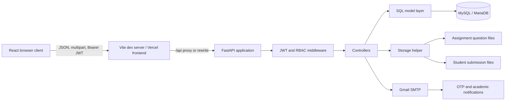
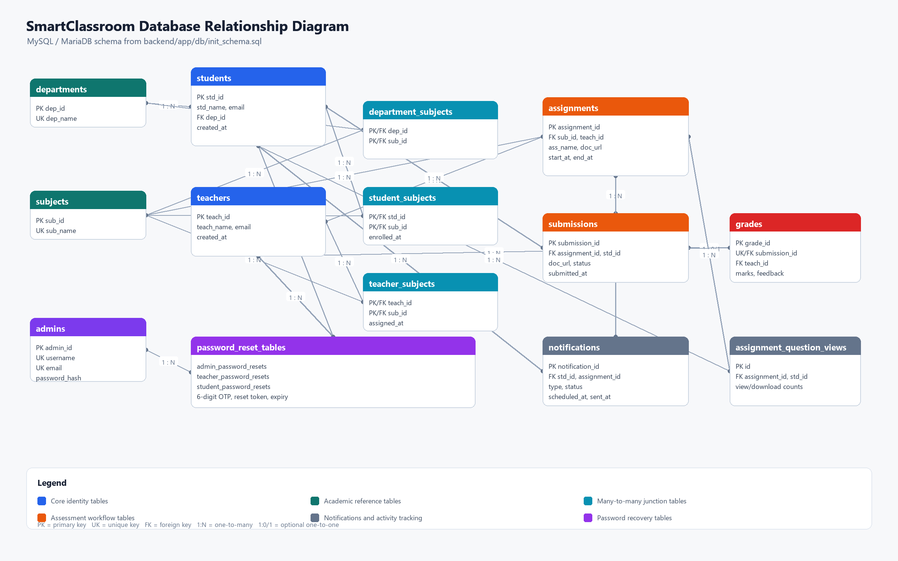
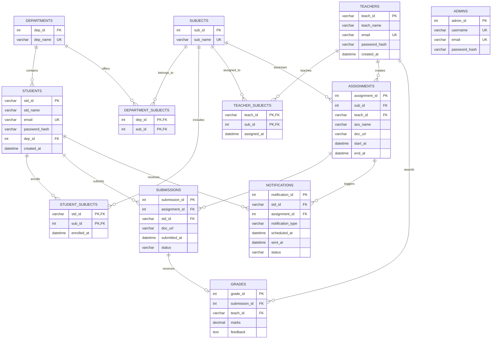
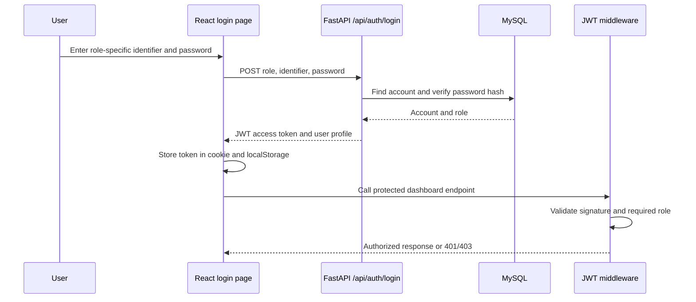
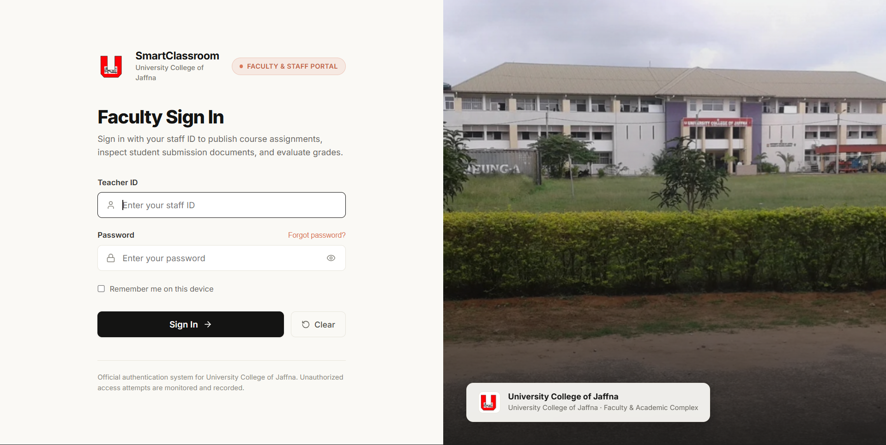
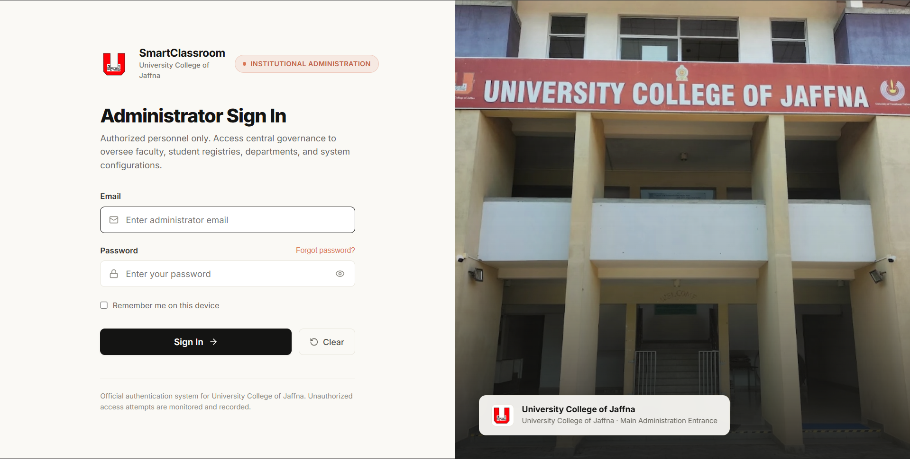
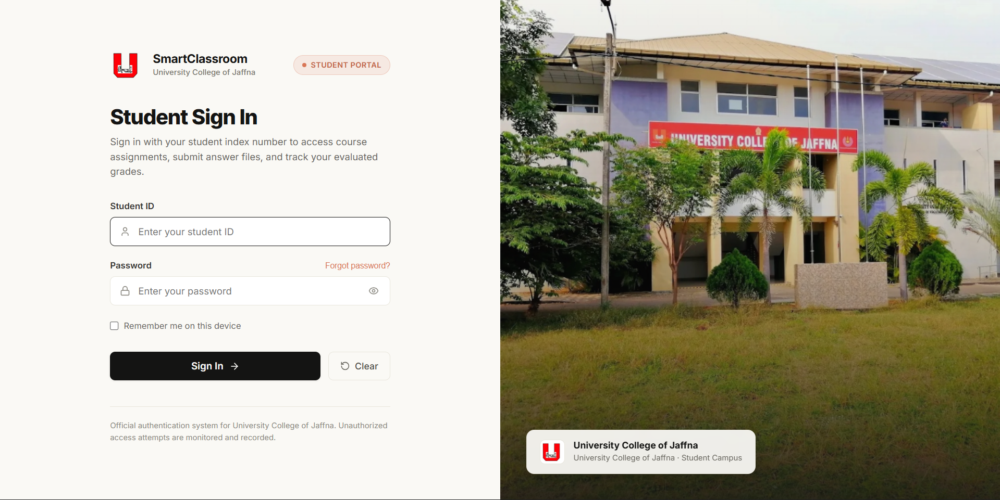

# SmartClassroom

SmartClassroom is a role-based academic assignment management platform for the University College of Jaffna (UCJ). It gives administrators control over academic data, teachers a workspace for publishing and grading coursework, and students a portal for viewing, submitting, and reviewing assignments.

The application is split into a React/Vite single-page frontend, a FastAPI REST API, and a MySQL/MariaDB database. JWT bearer authentication and role-based access control protect the three portals.

## Contents

Open this file in VS Code's **Markdown Preview** to use the links. When viewing the Markdown source, use **Ctrl+Click**; a normal click only places the cursor in the editor.

- [Capabilities](#capabilities)
- [Technology stack](#technology-stack)
- [Architecture](#architecture)
- [Database design](#database-design)
- [Application workflows](#application-workflows)
- [Login experiences](#login-experiences)
- [Project structure](#project-structure)
- [Local installation](#local-installation)
- [Running the project](#running-the-project)
- [API overview](#api-overview)
- [Deployment](#deployment)
- [Security and operational notes](#security-and-operational-notes)

## Capabilities

### Administrator portal

- Manage departments, subjects, teachers, and students.
- Link departments to subjects and automatically synchronize student subject enrollment.
- View system statistics and assessment analytics.
- Search and filter teacher and student registries.
- Edit or delete academic records with relationship-aware validation.

### Teacher portal

- View assigned subjects and create assignments with optional question files.
- Set opening dates, deadlines, and reminder intervals.
- Track submitted and pending students.
- Grade submissions with marks from 0 to 100 and written feedback.
- Trigger assignment-opened and grade-published email notifications.

### Student portal

- View enrolled subjects and available coursework.
- Preview or download question papers.
- Submit one answer document per assignment.
- View grades and teacher feedback.
- Receive assignment, deadline, and result notifications.

### Shared platform features

- Separate student, faculty, and administrator login pages.
- JWT authentication with role checks on protected API routers.
- Bcrypt password hashing, with a PBKDF2-SHA256 fallback in the password helper.
- Email-based six-digit OTP password recovery for all three roles.
- Secure file-name sanitization and separate question/submission storage directories.
- Responsive desktop and mobile layouts using Lucide icons.

## Technology stack

| Layer | Technology | Responsibility |
| --- | --- | --- |
| Frontend | React 19, Vite, React Router, Lucide React | Login pages, dashboards, navigation, uploads, filters, modals |
| Backend | Python 3.13, FastAPI, Uvicorn | REST API, validation, business rules, OpenAPI documentation |
| Data access | PyMySQL | Parameterized MySQL queries and transaction handling |
| Database | MySQL 8.x or MariaDB | Normalized academic, assignment, submission, grade, and notification data |
| Authentication | PyJWT, HTTP Bearer, bcrypt | Signed access tokens, password hashing, RBAC |
| Email | Gmail SMTP with Google App Password | OTP, assignment, deadline, and grade notifications |
| File handling | FastAPI multipart uploads, local storage or `/tmp` on Vercel | Question papers and student submissions |
| Hosting configuration | Render and Vercel manifests | API and frontend deployment |

## Architecture



### Backend request flow

1. The browser calls the API through `frontend/src/services/api.js`.
2. The client adds `Authorization: Bearer <token>` when a token is available. File uploads use `multipart/form-data`.
3. FastAPI routes validate request data with Pydantic schemas and apply `require_role(...)` to protected routers.
4. Controllers enforce business rules, call the model layer, and schedule notification work where appropriate.
5. The model layer uses parameterized PyMySQL queries and commits or rolls back through the database context manager.
6. The response returns JSON, a secured file response, or a clear HTTP error.

## Database design

The schema in `backend/app/db/init_schema.sql` is organized around the academic relationships rather than duplicated user data. Foreign keys protect referential integrity, unique keys prevent duplicate identities and submissions, and transactions keep multi-step administration operations consistent.

### PNG database diagram



Download or open the generated diagram here: [docs/database-schema.png](docs/database-schema.png)



### Important relationships and rules

- A student belongs to one department. Department subjects are synchronized into `student_subjects` when a student or department relationship changes.
- Teachers and students can each be linked to many subjects through junction tables.
- An assignment belongs to one subject and one teacher. Its question document is stored separately from relational metadata.
- A student can submit an assignment only once because `(assignment_id, std_id)` is unique.
- A submission has at most one grade. Marks are constrained to `0..100`.
- Deleting a department, subject, teacher, or student is constrained by dependent academic data where deleting it would destroy protected history.
- `admin_password_resets`, `teacher_password_resets`, and `student_password_resets` store short-lived OTP recovery state.
- The startup seeder creates `assignment_question_views` for student preview/download activity tracking; this runtime-created table is not in the initial schema diagram.

## Application workflows

### Authentication and authorization



### Assignment lifecycle

1. An administrator creates subjects and assigns them to departments and teachers.
2. A teacher creates an assignment, uploads a question file, and selects its opening and deadline dates.
3. The API stores the assignment and file metadata, then queues an assignment notification email for enrolled students.
4. A student sees the assignment, previews/downloads the question paper, and uploads one answer file.
5. The teacher opens the tracker, switches between submitted and pending students, and records a mark and feedback.
6. The grade is stored against the submission and the student receives a result notification.
7. The background reminder worker checks assignment start/deadline reminder flags every 60 seconds during a local server run.

### Password recovery

Each role follows the same server-side flow: registered email check, cryptographically generated six-digit OTP, OTP verification, temporary reset token, password update, and reset-record cleanup. The client never downloads a user email registry to perform the check locally.

## Login experiences

The UI intentionally keeps the portals separate so each user sees only the identity and language relevant to their role.

| Role | Primary URL | Identifier | Post-login route | Visual treatment |
| --- | --- | --- | --- | --- |
| Student | `/login` | Student ID / index number | `/student/st_dashboard` | UCJ student campus image and Student Portal badge |
| Teacher | `/staff/login` | Teacher ID / staff ID | `/staff/te_dashboard` | Faculty campus image and Faculty & Staff Portal badge |
| Administrator | `/staff/adlogin` | Administrator email | `/staff/ad_dashboard` | Administration entrance image and institutional badge |

### Login wireframes

Desktop uses a two-column layout with the form on the left and a UCJ campus photograph on the right. On smaller screens the photograph becomes the background/hero and the form becomes a touch-friendly foreground sheet.

```text
Desktop (all three portals)
┌────────────────────────────────────────────────────────────────────┐
│  UCJ mark  SmartClassroom          [Student / Faculty / Admin]     │
│                                                                    │
│  ┌─────────────────────────────┐  ┌─────────────────────────────┐ │
│  │ Student Sign In             │  │                             │ │
│  │ Supporting role description │  │       UCJ campus image      │ │
│  │                             │  │                             │ │
│  │ Student ID                  │  │       Role-specific cover   │ │
│  │ [ Enter identifier       ]  │  │                             │ │
│  │ Password       Forgot?      │  │                             │ │
│  │ [ Enter password   ◉     ]  │  │                             │ │
│  │ [ ] Remember me             │  │                             │ │
│  │ [        Sign In         ]  │  │                             │ │
│  └─────────────────────────────┘  └─────────────────────────────┘ │
└────────────────────────────────────────────────────────────────────┘

Mobile
┌──────────────────────────────┐
│       blurred campus hero    │
│  UCJ mark  SmartClassroom    │
│                              │
│  ┌────────────────────────┐  │
│  │ Student Sign In        │  │
│  │ [ Student ID         ] │  │
│  │ [ Password       ◉   ] │  │
│  │ Forgot password?       │  │
│  │ [       Sign In      ] │  │
│  └────────────────────────┘  │
└──────────────────────────────┘
```

Relevant implementation files are `frontend/src/pages/StudentLoginPage.jsx`, `TeacherLoginPage.jsx`, `AdminLoginPage.jsx`, and the shared `frontend/src/components/HumanAuthLayout.jsx`.

### Login page image assets

These are screenshots of the implemented role-specific login pages.

#### Teacher login image



Image file: [docs/ui/teacher-login.png](docs/ui/teacher-login.png)

#### Administrator login image



Image file: [docs/ui/admin-login.png](docs/ui/admin-login.png)

#### Student login image



Image file: [docs/ui/student-login.png](docs/ui/student-login.png)

## Project structure

```text
SmartClassroom/
├── api/index.py                 # Root Vercel serverless entry point
├── backend/
│   ├── api/index.py             # Backend-folder Vercel entry point
│   ├── app/
│   │   ├── main.py              # FastAPI app, CORS, startup and routers
│   │   ├── config/              # Environment and MySQL configuration
│   │   ├── controller/          # Business workflows
│   │   ├── db/init_schema.sql   # MySQL schema
│   │   ├── helper/              # Password, mail, storage, reminders
│   │   ├── middleware/auth.py   # JWT and RBAC dependencies
│   │   ├── model/               # SQL queries and Pydantic schemas
│   │   └── routes/              # Auth, admin, teacher, student, files
│   ├── storage/                 # Runtime question and submission files
│   ├── requirements.txt
│   └── .env.example
├── frontend/
│   ├── src/App.jsx              # Role-aware routing and guards
│   ├── src/services/api.js      # Fetch client and token storage
│   ├── src/components/          # Shared layouts and reset modal
│   ├── src/pages/               # Login and dashboard screens
│   ├── vite.config.js           # Local /api proxy
│   └── package.json
├── docs/
│   ├── database-schema.png      # PNG database relationship diagram
│   ├── ui/                       # Login page screenshots
│   │   ├── teacher-login.png
│   │   ├── admin-login.png
│   │   └── student-login.png
│   ├── JF_ICT_24_20_ProjectProposal.pdf
│   └── JF_ICT_24_20_SRS_Requirements_Baseline.pdf
├── render.yaml                  # Render API service definition
├── vercel.json                  # Root Vercel API definition
└── ai_work.md                  # Detailed implementation activity log
```

## Local installation

### Prerequisites

- Windows PowerShell, macOS, or Linux shell.
- Python 3.11+; the project was developed with Python 3.13.
- Node.js 18+ and npm.
- MySQL 8.x or MariaDB running on port `3306`.
- Git.

### 1. Clone and enter the repository

```powershell
git clone <repository-url>
cd SmartClassroom
```

### 2. Create the database

Create a database user with permission to create and update `smart_class`, then run the schema:

```powershell
mysql -u root -p < backend/app/db/init_schema.sql
```

The command creates the `smart_class` database and all tables. If the `mysql` command is not on `PATH`, run the same SQL file from MySQL Workbench or the MySQL client installed with your server.

### 3. Configure the backend

```powershell
cd backend
Copy-Item .env.example .env
```

Edit `backend/.env` with local values. Use placeholders such as these; never commit real passwords or API tokens:

```dotenv
DB_HOST=localhost
DB_PORT=3306
DB_USER=smartclass_user
DB_PASSWORD=change-me
DB_NAME=smart_class
JWT_SECRET=replace-with-a-long-random-secret
JWT_ALGORITHM=HS256
ACCESS_TOKEN_EXPIRE_MINUTES=1440
CORS_ORIGINS=http://localhost:5173

# Optional email delivery
SMTP_HOST=smtp.gmail.com
SMTP_PORT=587
SMTP_USER=your-address@gmail.com
SMTP_PASSWORD=your-google-app-password
SMTP_FROM_NAME=SmartClassroom-UCJ

ASSIGNMENT_QUESTIONS_DIR=storage/assignment_questions
STUDENT_SUBMISSIONS_DIR=storage/student_submissions
```

Create and activate a virtual environment, then install dependencies:

```powershell
python -m venv .venv
.\.venv\Scripts\Activate.ps1
python -m pip install --upgrade pip
pip install -r requirements.txt
```

If PowerShell blocks activation, run `Set-ExecutionPolicy -Scope Process Bypass` for the current terminal or invoke `.venv\Scripts\python.exe` directly.

### 4. Install frontend dependencies

```powershell
cd ..\frontend
npm install
```

Local Vite requests to `/api` are proxied to `http://localhost:8000` by `frontend/vite.config.js`. Set `VITE_API_BASE_URL` only when the API is hosted elsewhere.

## Running the project

Open two terminals from the repository root.

### Terminal 1: API

```powershell
cd backend
.\.venv\Scripts\Activate.ps1
uvicorn app.main:app --reload --host 0.0.0.0 --port 8000
```

API and documentation:

- Health response: `http://localhost:8000/`
- Swagger UI: `http://localhost:8000/docs`
- ReDoc: `http://localhost:8000/redoc`

### Terminal 2: frontend

```powershell
cd frontend
npm run dev
```

Open `http://localhost:5173`. The three login pages are:

- Student: `http://localhost:5173/login`
- Teacher: `http://localhost:5173/staff/login`
- Administrator: `http://localhost:5173/staff/adlogin`

The backend seeds initial development data on local startup when the database is reachable. Treat seeded credentials as development-only and change them before deployment.

### Production frontend check

```powershell
cd frontend
npm run build
npm run preview
```

The build output is written to `frontend/dist`. The backend can be syntax-checked with:

```powershell
cd backend
python -m compileall app api
```

## API overview

All endpoints below are prefixed with `/api` unless stated otherwise. Protected endpoints require a JWT bearer token and the role shown.

| Area | Main endpoints | Role |
| --- | --- | --- |
| Authentication | `POST /auth/login`, `GET /auth/me` | Public / authenticated |
| Password recovery | `/auth/admin/*`, `/auth/teacher/*`, `/auth/student/*` | Public with server-side checks |
| Administration | `/admin/stats`, `/admin/departments`, `/admin/subjects`, `/admin/teachers`, `/admin/students` | Admin |
| Teaching | `/teacher/subjects`, `/teacher/assignments`, `/teacher/assignments/{id}/submissions`, `/teacher/submissions/{id}/grade` | Teacher |
| Student work | `/student/profile`, `/student/subjects`, `/student/assignments`, `/student/assignments/{id}/submit`, `/student/grades` | Student |
| Files | `/files/{category}/{filename}` | File path validation and question-paper start-time lock |

Interactive request and response schemas are available at `/docs` while the API is running.

## Deployment

### Render backend

`render.yaml` defines a Python web service rooted at `backend`:

```text
Build: pip install -r requirements.txt
Start: uvicorn app.main:app --host 0.0.0.0 --port $PORT
Health: /
```

Add `DB_HOST`, `DB_PORT`, `DB_USER`, `DB_PASSWORD`, `DB_NAME`, `JWT_SECRET`, `CORS_ORIGINS`, and optional SMTP variables in the Render environment. Set `CORS_ORIGINS` to the deployed frontend origin.

### Vercel frontend and API

- `frontend/vercel.json` rewrites `/api/*` to the deployed backend URL and sends client-side routes to `index.html`.
- `frontend` can be deployed as a Vite project with `npm run build` and `dist` as the output directory.
- The root and `backend` Vercel manifests provide Python serverless entry points.
- Vercel file storage is ephemeral; production deployments should use persistent object storage if uploaded documents must survive serverless instance replacement.

## Security and operational notes

- Never commit `.env`, `.env.local`, Google App Passwords, database passwords, JWT secrets, or Vercel tokens.
- Rotate any credential that has ever been placed in a tracked or shared environment file.
- Use a long random `JWT_SECRET` and set a restrictive `CORS_ORIGINS` value in production.
- Password reset OTPs are short-lived and should be delivered only through a correctly configured SMTP account.
- The current `/api/files/{category}/{filename}` route validates storage categories, sanitizes filenames, prevents traversal, and locks question papers until their start time, but it does not currently require a JWT dependency. Treat file URLs as discoverable and add role-aware authorization before using this route for sensitive production documents.
- Development storage is local under `backend/storage`; Vercel defaults to `/tmp`, which is not durable.
- Run the reminder worker in a single long-lived backend process. Serverless deployments should use a scheduled job or external queue for reliable reminders.
- Do not use the seeded development accounts in a production environment.

## License

See [LICENSE](LICENSE).
